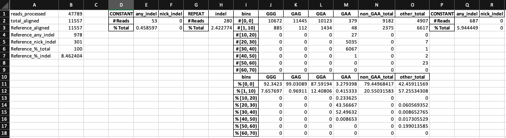

# powTNRka
PowTNRka is a CRISPResso2-like software that can align sequencing reads against
repetitive sequences. Its name comes from the Polish word "powtórka", meaning 
"repeat".

## System requirements
### Software dependencies
PowTNRka is written in Python 3.8 with Cython. A full list of package
dependencies can be found in `requirements.txt`.

### Operating systems
PowTNRka has been tested on MacOS and Linux, though it should also work with
Windows.

## Installation
To install powTNRka in a Python virtual environment, run:
```commandline
git clone https://github.com/alvin-hsu/powtnrka
cd powtnrka
python -m venv ./venv
. venv/bin/activate
pip install -r requirements.txt
```
Installation should typically take 10 to 15 minutes.

## Instructions for use
To run powTNRka, you need to provide a "reference" template. This can be any
nucleotide sequence in IUPAC nomenclature. To denote repeats, simply use a
template with the repeated sequence in parentheses. If you are interested in
comparisons against a specific repeat sequence (i.e., for base editing), then
a specific sequence can also be specified. For example, for base editing in the
*FXN* gene, the reference template looks like this:
```
>Reference
ACTAACCTGGCCAACATGGTGAAACCCAGTATCTACTAAAAAATACAAAAAAAAAAAAAAAA(GAA|GRR)AATAAAG
AAAAGTTAGCCGGGCGTGGTGTCGCGCGCCTGTAATCCCAGCTACTCCAGAGGCTGCGGCAGGAGAATCGCTTGAGCC
CGGGAGGCAGAGGTTGCATTAA
```
Here, the reference looks for `GRR` repeats, which encapsulates all possible
alleles that can result from base editing of a `GAA` repeat. Here, we've also
added `(GAA)` as a specific allele so that calculating the number of edited 
repeats in a genotype can be done by simply subtracting the number of repeats
aligned to `GRR` from those aligned to `GAA`.

To run powTNRka, if `$R1_FASTQ` is the sequencing output FASTQ file and
`$OUT_DIR` is the output directory, run:
```commandline
main.py $R1_FASTQ $OUT_DIR -a $REF  # Specify template in command
```
or
```commandline
main.py $R1_FASTQ $OUT_DIR -af $REF_FASTA  # Specify template in FASTA
```

### Expected output
PowTNRka outputs three main files for each run: `Reference_DETAILED.xlsx` is 
an Excel file with a detailed breakdown (by segment) for every read in tabs.
`Reference_FULL_alignments.csv` is a CSV file with alignments for each read.
`Reference_SUMMARY.xlsx` is an Excel file with a summary of the run outputs.
Here is a screenshot of a summary file:


The expected runtime on a file with ~50,000 reads is 10 minutes on an average
desktop computer.
